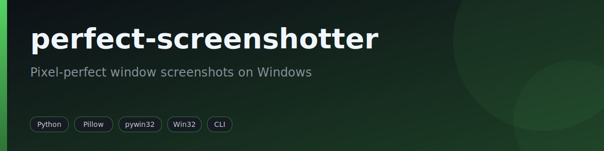
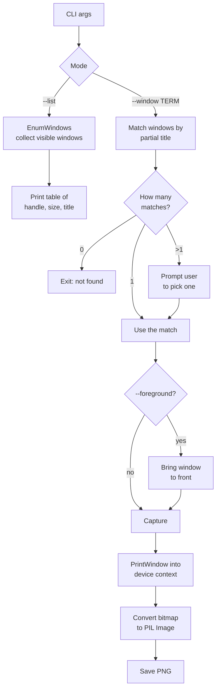

<div align="center">



[](LICENSE) [](https://www.python.org) [](#)

</div>

> Pixel-perfect window screenshots on Windows.

`perfect-screenshotter` is a tiny command-line utility that captures a single Windows window by partial title match. It uses the Win32 `PrintWindow` API so the capture is accurate even when the target window is partially occluded or layered, and it is DPI-aware so dimensions match the real on-screen pixels.

## Features

- List all visible windows with their handle, size, and title.
- Find a target window by case-insensitive partial title match, with interactive disambiguation when several windows match.
- Capture the full window (borders and title bar) or only the client area.
- DPI-aware capture for accurate dimensions on high-DPI displays.
- Optionally bring the target window to the foreground before capturing.
- Save as PNG to a chosen path, or auto-name as `screenshots/<title>_<timestamp>.png`.

## How it works



## Requirements

- Windows
- Python 3.8+
- [Pillow](https://python-pillow.org/) >= 10.0.0
- [pywin32](https://github.com/mhammond/pywin32) >= 306

## Installation

```powershell
git clone https://github.com/fabricioguidine/perfect-screenshotter.git
cd perfect-screenshotter
python -m venv .venv
.\.venv\Scripts\Activate.ps1
pip install -r requirements.txt
```

## Usage

```powershell
# List all visible windows
python screenshotter.py --list

# Include windows that have no title
python screenshotter.py --list --all

# Capture a window whose title contains "Notepad"
python screenshotter.py --window "Notepad"

# Save to a specific file
python screenshotter.py --window "Chrome" -o out.png

# Capture only the client area (no title bar or borders)
python screenshotter.py --window "Code" --client

# Bring the window to the foreground before capturing
python screenshotter.py --window "Notepad" --foreground
```

| Flag | Short | Description |
| --- | --- | --- |
| `--list` | `-l` | List all visible windows |
| `--window TERM` | `-w` | Window title to search for (partial match) |
| `--output PATH` | `-o` | Output file path (default: `screenshots/<title>_<timestamp>.png`) |
| `--client` | `-c` | Capture only the client area (exclude title bar and borders) |
| `--foreground` | `-f` | Bring the window to the foreground before capture |
| `--all` | `-a` | With `--list`, also show windows that have no title |

## Project structure

```
perfect-screenshotter/
├── screenshotter.py    # CLI entry point and capture logic
├── requirements.txt    # Pillow, pywin32
├── LICENSE
└── .gitignore
```

## License

[MIT](LICENSE)
